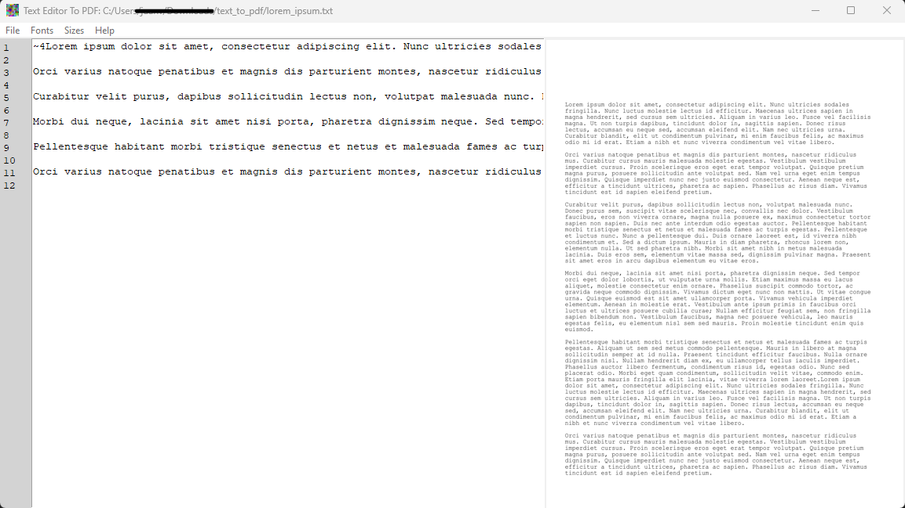
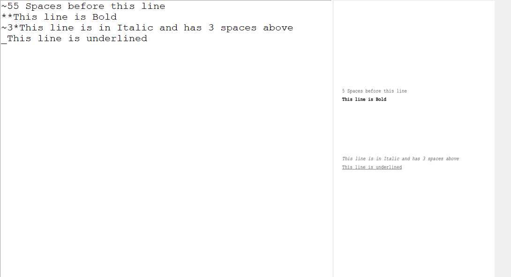

# Text Editor To PDF

This script is a Python application that allows users to create and edit plain text documents and save them as PDF files. It is built using the `tkinter` library for the graphical user interface, the `fpdf` library for generating PDF files, the `PIL` library for image manipulation and the `pdf2image` library for converting PDF files to images. The script creates a window with a text editor on the left side and a PDF viewer on the right side.

## Requirements

The following Python libraries are required to be installed before running this [script](text_editor_to_pdf.py):

- tkinter
- fpdf
- PIL
- pdf2image

You can install them using the pip package manager:

```python
pip install -r requirements.txt
```

The `poppler` package is also required for converting PDF files to images. On Windows, you can download it from this [website](https://blog.alivate.com.au/poppler-windows/) or find it [here](executable/poppler-0.68.0/) and add the path to the `poppler/bin` folder to the system `PATH` environment variable or place the `poppler` folder in the same folder as the script/executable.

## How to Use

### Script

1. Run the script from the command line: python text_editor_to_pdf.py
2. Enter or edit the text in the left side text editor.
3. Click the "To PDF" button in the toolbar to save the text as a PDF file.
4. Choose a name and location for the PDF file and click "Save".
5. The PDF file will be displayed in the right side PDF viewer. In case a PDF for the file is already created, it will be shown when a text file is opened.

### Executable

1. Run the script by executing text_editor_to_pdf.exe, found [here](executable/)
2. Enter or edit the text in the left side text editor.
3. Click the "To PDF" button in the toolbar to save the text as a PDF file.
4. Choose a name and location for the PDF file and click "Save".
5. The PDF file will be displayed in the right side PDF viewer. In case a PDF for the file is already created, it will be shown when a text file is opened.

The user can select the font type and size for the text editor, and the PDF viewer can be scrolled vertically. The line numbers in the text editor are automatically updated as the user types or edits the text.

Note: The script uses a random icon for the window. You can replace it with your own icon by replacing the img object at the beginning of the script with your own image.

View of the application:



## Formatting

The application also has a convention to apply styles to sentences based on the initial characters of the sentence.
The help tab of the application shows a message about the formatting styles, which are as follows:

- ~# 'Words' : adds # of spaces before the line starting with 'Words'.
- ** 'Words' : adds the Bold style to the line starting with 'Words'.
- \* 'Words' : adds the Italic style to the line starting with 'Words'.
- _ 'Words' : adds the Underline style to the line starting with 'Words'.

The resulting PDF can be seen as follows:


